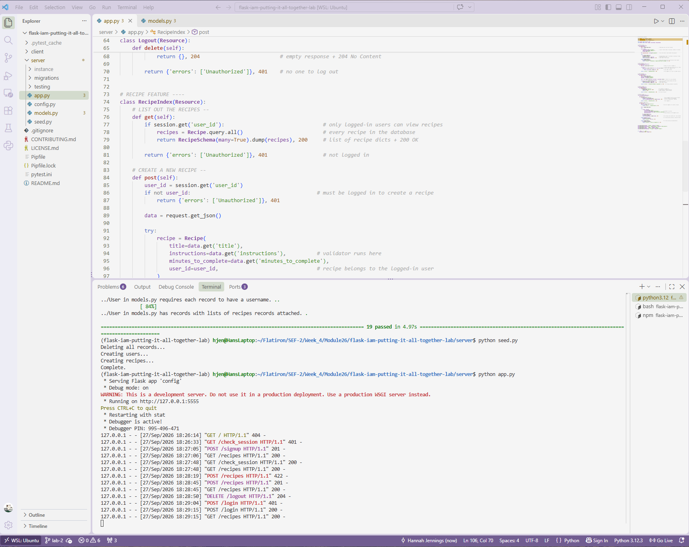

# Lab: Putting it All Together - IAM Flask API
**Completed Sept 27, 2026**

## Description

A full-stack recipe-sharing app with a Flask REST API backend and a React frontend. Users can sign up, log in, stay logged in across page refreshes, log out, browse recipes, and create their own. Authentication and authorization are handled with Flask sessions and cookies, and passwords are securely hashed with bcrypt.
 



## Features
 
- **Sign up** with a username, password, profile image URL, and bio
- **Log in and log out** using session-based authentication
- **Auto-login** so users stay signed in after refreshing the page
- **View all recipes**, each showing the user who created it (logged-in users only)
- **Create recipes** that belong to the logged-in user, with validation errors shown in the frontend
- **Secure passwords**: only bcrypt hashes are stored, and hashes can never be read back or sent in API responses


## Tech Stack
 
- **Backend:** Python, Flask, Flask-RESTful, Flask-SQLAlchemy, Flask-Migrate, Flask-Bcrypt, marshmallow
- **Database:** SQLite
- **Frontend:** React
- **Testing:** pytest


## Installation
 
Clone the repository and move into the project folder:
 
```
git clone https://github.com/hanjennings1/flask-iam-putting-it-all-together-lab.git
cd flask-iam-putting-it-all-together-lab
```
 
Install the backend and frontend dependencies:
 
```
pipenv install && pipenv shell
npm install --prefix client
```
 
Set up and seed the database from the `server` folder:
 
```
cd server
flask db upgrade head
python seed.py
```
 
The seed script creates 20 users and 100 recipes. Each seeded user's password is their username followed by `password` (for example, the user `Maria` has the password `Mariapassword`).
 
## Usage
 
Run the Flask API from the `server` folder (it runs on port 5555):
 
```
python app.py
```
 
In a second terminal, run the React app from the project root:
 
```
npm start --prefix client
```
 
Then open `http://localhost:3000` in your browser to sign up, log in, and create recipes.
 
## API Endpoints
 
| Method | Endpoint | Description | Success | Errors |
|---|---|---|---|---|
| POST | `/signup` | Creates a user and logs them in | 201 | 422 if the username is missing or taken |
| GET | `/check_session` | Returns the logged-in user | 200 | 401 if not logged in |
| POST | `/login` | Logs in with username and password | 200 | 401 if credentials are invalid |
| DELETE | `/logout` | Logs out the current user | 204 | 401 if not logged in |
| GET | `/recipes` | Lists all recipes with nested user data | 200 | 401 if not logged in |
| POST | `/recipes` | Creates a recipe for the logged-in user | 201 | 401 if not logged in, 422 if invalid |
 
Error responses use the format `{"errors": ["message"]}` so the frontend can display more than one error.
 
## Models
 
**User**: `id`, `username` (required, unique), `_password_hash`, `image_url`, `bio`. A user has many recipes. The password can be set through `password_hash`, which stores a bcrypt hash, but reading `password_hash` raises an `AttributeError`. The `authenticate` method checks a password attempt against the stored hash.
 
**Recipe**: `id`, `title` (required), `instructions` (required, at least 50 characters), `minutes_to_complete`, `user_id`. A recipe belongs to a user.
 
Both models are serialized with marshmallow schemas. `UserSchema` excludes the password hash, and `RecipeSchema` includes the recipe's user as a nested object.
 
## Project Structure
 
```
.
├── client/               # React frontend
├── server/
│   ├── app.py            # API routes (Flask-RESTful resources)
│   ├── config.py         # App, database, bcrypt, and API setup
│   ├── models.py         # User and Recipe models and schemas
│   ├── seed.py           # Seeds the database with sample data
│   ├── migrations/       # Database migrations
│   └── testing/          # Model and route tests
├── Pipfile
└── README.md
```
 
## Running Tests
 
From the `server` folder:
 
```
pytest
```
 
Note that the tests use the same `app.db` database and clear its records, so run `python seed.py` again afterward if you want sample data in the app.